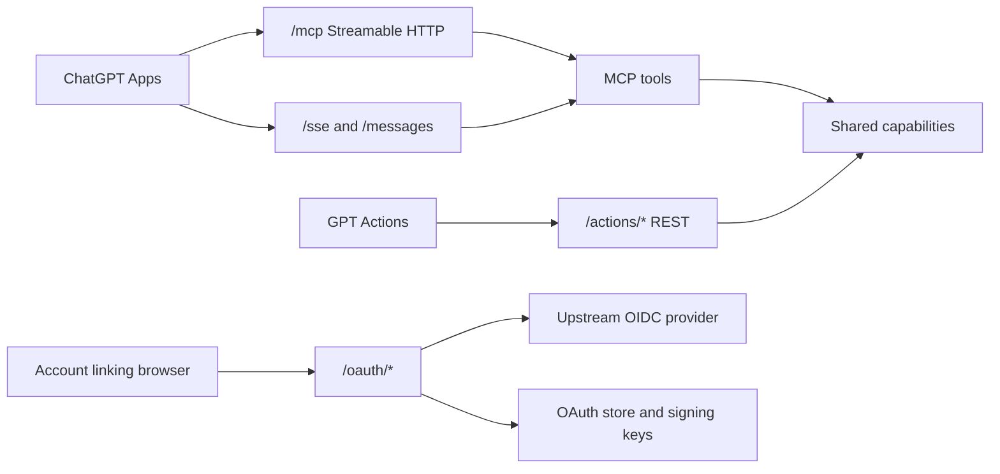
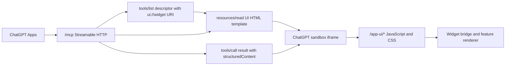

# Encore MCP Base

Production TypeScript foundation for private ChatGPT Apps, GPT Actions, OAuth, and upstream OpenID Connect.

Encore MCP Base gives engineering teams one secure service boundary for ChatGPT integration work. It exposes MCP Streamable HTTP for GPT Apps, OpenAPI-backed REST endpoints for GPT Actions, and a private OAuth/OIDC provider that bridges account linking to any upstream OIDC identity provider with authorization, token, and userinfo endpoints.

The runtime service uses TypeScript, Encore, and the Node standard library. The runtime dependency list is intentionally small: `encore.dev`. Development and verification use TypeScript, Node test runner, and `oauth4webapi` for independent OAuth client behavior.

Start with the full documentation map at [docs/index.md](docs/index.md).

## Designed For

- GPT builders who need Apps and Actions from one authenticated backend.
- Security owners who need clear audiences, scopes, client records, and external identity proof.
- Operators who need public HTTPS deployment, secret placement, key rotation, and release checks.
- Maintainers who need small code files, protocol-owned tests, and documentation that stays outside runtime code.

## At A Glance

| Area | Included behavior |
| --- | --- |
| GPT Apps | MCP Streamable HTTP at `/mcp`, legacy HTTP/SSE at `/sse` and `/messages`, UI resources, widget assets at `/app-ui/*`, protocol baseline `2025-11-25`. |
| GPT Actions | REST endpoints, OpenAPI 3.1, public read-only schema at `/actions/openapi.json`, read-only operation declarations for ChatGPT. |
| OAuth provider | Authorization code grants, refresh grants, PKCE, client authentication, RS256 access tokens, ID tokens, JWKS, discovery, userinfo. |
| Upstream identity | OIDC authorization bridge through `/oauth/callback`, upstream userinfo claim validation, generic provider configuration. |
| Security | Audience-bound tokens, scope checks, duplicate-header rejection, query bearer rejection, rate limits, diagnostics redaction, hashed stored tokens. |
| Operations | Production startup validation, durable JSON state, AWS CDK deployment, Systems Manager Parameter Store, KMS-backed secrets. |
| Maintainability | Small domain modules, shared capability code, protocol adapters, focused tests under `test/`, docs under `docs/`. |

## Standards Baseline

| Standard or platform | Project use | Detail |
| --- | --- | --- |
| MCP `2025-11-25` | GPT Apps transport, tool, and resource protocol. | Streamable HTTP at `/mcp`, legacy HTTP/SSE compatibility, session IDs, protocol negotiation, tool descriptors, resource descriptors, auth challenges. |
| OpenAI ChatGPT Apps | Remote MCP server integration. | OAuth account linking, protected resource metadata, Client ID Metadata Document support, read-only tool declarations, UI resource templates, widget CSP metadata, server instructions. |
| GPT Actions | REST action import and OAuth linking. | OpenAPI URL import, OAuth authorization URL, token URL, scopes, bearer-protected operations, read-only action metadata. |
| OAuth 2.0 and OIDC | Account linking and identity. | Authorization code flow, PKCE, refresh tokens, resource indicators, authorization server metadata, protected resource metadata, userinfo, ID tokens, JWKS. |
| OpenAPI 3.1 | Actions schema. | OAuth2 authorization code flow, JSON response schemas, operation IDs, schema descriptions, and compatibility checks. |
| AWS CDK and Parameter Store | Deployment path. | EC2 runtime, Caddy HTTPS, ECR, CodeBuild, Route53, Systems Manager parameters, SecureString secrets, KMS. |

The source map for external specifications and platform documents lives in [External References](docs/reference/external-references.md).

## Runtime Shape



The main service runtime keeps protocol adapters at the edge. ChatGPT Apps reach MCP transports, GPT Actions reach REST endpoints, account linking reaches OAuth routes, and each path uses shared capability modules where behavior overlaps. OAuth uses the configured upstream OIDC provider and the OAuth store for client grants, tokens, and signing keys.

## Widget Framework Runtime Shape



The widget framework runtime starts when ChatGPT reads a tool descriptor that declares a `ui://` widget URI. ChatGPT reads the matching MCP UI resource, calls the render tool, passes `structuredContent` into the sandbox iframe, and the iframe loads the versioned widget assets from `/app-ui/*`. Detailed widget implementation guidance lives in [MCP Apps UI Resources](docs/development/mcp-app-ui-resources.md).

## Prerequisites

| Requirement | Use |
| --- | --- |
| Node.js and npm | Install packages, run TypeScript checks, run Node test suites, and run local tools. |
| Encore CLI | Run the TypeScript service locally and deploy through Encore-supported service wiring. |
| Public HTTPS origin | Connect ChatGPT Apps, import GPT Actions, complete OAuth account linking, and publish discovery metadata. |
| Upstream OIDC provider | Supply the signed-in user identity through authorization, token, and userinfo endpoints. |
| AWS CLI and CDK tools | Use the included AWS deployment path, Parameter Store seeding, stack operations, and release checks. |

## Quick Start

Install Node.js, npm, and the Encore CLI. Then run the service:

```sh
npm install
npm run dev
```

Use a second terminal for first checks:

```sh
curl http://localhost:4000/health
curl http://localhost:4000/.well-known/openid-configuration
curl http://localhost:4000/.well-known/oauth-protected-resource/mcp
curl http://localhost:4000/actions/openapi.json
```

Export a local Actions schema file:

```sh
npm run openapi -- --base-url http://localhost:4000 --out var/actions.openapi.json
```

Local development supplies local URLs, generated signing keys, development OAuth clients, and a durable store at `var/oauth-store.json`. Automated tests start a local upstream OIDC provider for real authorization-code flows.

## Local Defaults

| Area | Local value |
| --- | --- |
| Service origin | `http://localhost:4000` |
| OAuth callback | `http://localhost:4000/oauth/callback` |
| Default scopes | `openid profile email` |
| Development clients | `local-test`, `gpt-actions`, `gpt-apps-mcp` |
| Durable store | `var/oauth-store.json` |
| Actions schema export | `var/actions.openapi.json` |

## ChatGPT Setup Values

Use these production URL shapes after deploying the service behind HTTPS:

| ChatGPT field | Value |
| --- | --- |
| GPT Apps MCP server URL | `https://service.example.com/mcp` |
| GPT Actions schema import URL | `https://service.example.com/actions/openapi.json` |
| OAuth authorization URL | `https://service.example.com/oauth/authorize` |
| OAuth token URL | `https://service.example.com/oauth/token` |
| OAuth scopes | `openid profile email` |
| Privacy policy URL | `https://service.example.com/privacy` |

Use registered client IDs and client secrets from the production client registry. The AWS CDK seed command stores generated ChatGPT client secrets in Systems Manager Parameter Store.

Local development values live in [GPT Apps Setup](docs/user-guides/gpt-apps.md) and [GPT Actions Setup](docs/user-guides/gpt-actions.md).

## Current Capability Surface

### MCP Tools

| Tool | Required scopes | Purpose |
| --- | --- | --- |
| `health.check` | none | Return service reachability and version metadata. |
| `health.status_card` | none | Render service health as an inline ChatGPT UI card. |
| `identity.profile` | `openid profile email` | Return the signed-in OIDC profile. |
| `identity.profile_card` | `openid profile email` | Render the signed-in OIDC profile as an inline ChatGPT UI card. |
| `auth.session` | `openid` | Return token subject, client ID, audience, and granted scopes. |

### MCP UI Resources

| Resource URI | Required scopes | Purpose |
| --- | --- | --- |
| `ui://widget/health-status-card-v1.html` | none | HTML component template for service health. |
| `ui://widget/profile-summary-card-v1.html` | `openid profile email` | HTML component template for the signed-in OIDC profile. |

### Widget Framework Assets

| Asset | Purpose |
| --- | --- |
| `/app-ui/mcp-widget-bridge-v2.js` | Shared bridge for initial tool output, late ChatGPT globals, and later tool-result messages. |
| `/app-ui/tool-result-card-base-v1.css` | Shared responsive card layout for declarative tool-result widgets. |

Feature widgets add their own versioned `/app-ui/*` JavaScript and CSS assets. The full asset list is documented in [MCP API Reference](docs/api/mcp.md).

### Actions Endpoints

| Endpoint | Required scopes | Purpose |
| --- | --- | --- |
| `GET /health` | none | Return service reachability. |
| `GET /privacy` | none | Return the public privacy policy text. |
| `GET /actions/openapi.json` | none | Return the ChatGPT Actions OpenAPI document. |
| `GET /actions/profile` | `openid profile email` | Return the authenticated OIDC profile. |
| `GET /actions/session` | `openid` | Return token session metadata. |

Current Actions operations are read-only and declare `x-openai-isConsequential: false`.

## OAuth And Identity

The service acts as the OAuth provider that ChatGPT talks to during account linking. The upstream identity provider supplies the actual signed-in user identity through OIDC.

Core OAuth behavior:

- `GET /oauth/authorize` validates the ChatGPT authorization request and redirects to the upstream provider.
- `GET /oauth/callback` consumes the upstream authorization response and creates a service authorization code.
- `POST /oauth/token` exchanges authorization codes and refresh tokens.
- `GET /oauth/userinfo` returns the profile bound to the access token.
- `GET /oauth/jwks` publishes public signing keys.
- Well-known metadata publishes OAuth, OIDC, and protected-resource discovery.

Supported client authentication methods are `client_secret_post`, `client_secret_basic`, `private_key_jwt`, and `none` for metadata-document public clients. Production clients should use explicit client records with approved redirect URIs, scopes, resources, and authentication methods.

External OIDC providers are first-class. AWS CDK Cognito mode is an optional quick-start upstream provider for deployments that need one.

## Security Posture

The service is built as production infrastructure from the first commit.

- Production startup requires public HTTPS URLs, durable storage, explicit origins, registered clients, upstream OIDC settings, signing keys, token lifetimes, and rate limits.
- Access tokens are RS256 JWTs with issuer, subject, audience, expiration, client ID, scopes, and profile claims.
- MCP endpoints require the MCP audience. Actions endpoints require the Actions audience.
- Protected MCP tools, MCP resources, and Actions endpoints enforce scopes at the adapter boundary.
- Query-string bearer tokens are rejected.
- Duplicate authorization headers are rejected.
- OAuth state, refresh tokens, rate-limit buckets, and MCP sessions use a durable JSON store.
- Sensitive tokens and session IDs are stored as hashes.
- Diagnostics are designed for safe operational signals and secret redaction.
- CORS origins are explicit and wildcard origins are rejected.

Security details live in [Security Model](docs/architecture/security-model.md), [OAuth Provider](docs/architecture/oauth-provider.md), and [Security Review](docs/development/security-review.md).

## Production Readiness Evidence

| Area | Required evidence |
| --- | --- |
| Public URLs | `PUBLIC_ISSUER_URL`, `MCP_RESOURCE_URL`, and `ACTIONS_AUDIENCE` use public HTTPS values. |
| OAuth clients | Production client records contain exact redirect URIs, allowed scopes, allowed resources, auth method, PKCE policy, and secret hashes where required. |
| Upstream identity | The upstream OIDC provider accepts `/oauth/callback` and returns `sub`, `email`, and `email_verified` through userinfo. |
| Secrets | Raw client secrets, upstream IdP secret, and signing key material are loaded from secure runtime configuration. |
| Storage | `OAUTH_STORE_PATH` points to durable storage owned by the service user. |
| Origins | `ALLOWED_ORIGINS` contains explicit browser origins used by ChatGPT and local development. |
| OpenAPI | `/actions/openapi.json` returns OpenAPI 3.1 with OAuth URLs on the deployed origin. |
| Verification | Targeted tests pass for the changed surface and `npm run check` passes before release. |

## Project Layout

| Path | Purpose |
| --- | --- |
| `auth/` | OAuth provider, upstream OIDC bridge, client registry, token issuance, storage, rate limits, discovery. |
| `mcp/` | MCP transports, JSON-RPC protocol, sessions, tool registry, UI resource registry, widget framework, validation, auth challenges. |
| `actions/` | GPT Actions endpoints, bearer validation, privacy endpoint, OpenAPI document. |
| `shared/` | Configuration, HTTP helpers, JSON helpers, diagnostics, crypto, service metadata. |
| `ci/cdk/` | AWS CDK stack, deployment commands, runtime parameter seeding, image build helpers. |
| `tools/` | Local operator tools and static repository checks. |
| `test/` | Service behavior tests, protocol tests, security tests, CDK tests, support harnesses. |
| `docs/` | API references, architecture, deployment, development, maintenance, and user guides. |

The development rule is simple: put shared behavior in one focused module, then expose it through MCP and Actions adapters.

## Verification

Run targeted tests while changing one surface:

```sh
node --experimental-strip-types --test --test-concurrency=1 test/mcp/transport-bearer.test.ts
```

Run the full gate before release:

```sh
npm run check
```

The full gate runs TypeScript typecheck, dependency checks, architecture checks, file-scope checks, test-placement checks, and the full Node test suite.

The test harness uses real service processes, local upstream OIDC servers, OAuth client helpers, raw HTTP checks, SSE helpers, and MCP JSON-RPC helpers. Tests are tied to live functionality and protocol behavior.

## Deployment

Production deployment can run through the AWS CDK project in `ci/cdk/`.

The CDK path provisions:

- EC2 on Amazon Linux 2023 ARM64.
- Caddy HTTPS termination.
- ECR image storage.
- CodeBuild image builds.
- Route53 DNS.
- KMS key for SecureString values.
- Systems Manager Parameter Store runtime configuration.
- Optional Cognito upstream OIDC provider.
- Runtime service container with durable OAuth state.

Operator-specific values stay outside tracked source. Use environment variables, CI secrets, ignored local shell files, or a secure operator runbook for account IDs, hosted zone IDs, domains, parameter paths, client secrets, and stack names.

Deployment guides:

- [Production Deployment](docs/deployment/production.md)
- [AWS CDK Deployment](docs/deployment/aws-cdk.md)
- [CDK Operations](docs/deployment/cdk-operations.md)
- [Runtime Parameters](docs/deployment/runtime-parameters.md)
- [Identity Provider](docs/deployment/identity-provider.md)
- [Release Verification](docs/deployment/release-verification.md)

## Documentation Map

| Need | Start here |
| --- | --- |
| Run locally | [Local Development](docs/user-guides/local-development.md) |
| Connect GPT Apps | [GPT Apps Setup](docs/user-guides/gpt-apps.md) |
| Add ChatGPT UI resources and widgets | [MCP Apps UI Resources](docs/development/mcp-app-ui-resources.md) |
| Import GPT Actions | [GPT Actions Setup](docs/user-guides/gpt-actions.md) |
| Understand architecture | [Architecture Overview](docs/architecture/overview.md) |
| Review APIs | [API Documentation](docs/api/index.md) |
| Check external specs | [External References](docs/reference/external-references.md) |
| Add a capability | [Adding Capabilities](docs/development/adding-capabilities.md) |
| Test changes | [Testing](docs/development/testing.md) |
| Operate storage | [Storage Maintenance](docs/maintenance/storage.md) |
| Rotate keys | [Signing Key Rotation](docs/maintenance/key-rotation.md) |

## Development Principles

- Keep runtime code small, named, and domain-owned.
- Keep durable explanations in `docs/`.
- Keep service tests under `test/`.
- Keep documentation review manual and reader-focused.
- Keep protocol behavior backed by live service tests.
- Keep commits scoped to one feature, fix, refactor, or documentation slice.
