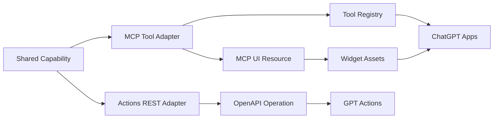

# Capabilities

Capabilities are the service behaviors that GPT clients can invoke. A capability can be exposed through MCP for GPT Apps, through REST for GPT Actions, or through both surfaces.

## Current Capabilities

| Capability | MCP tool | Actions endpoint | Required scopes | Output intent |
| --- | --- | --- | --- | --- |
| Service health | `health.check` | `GET /health` | none | Confirm service reachability and version metadata. |
| Service health UI | `health.status_card` | none | none | Render service health as an inline ChatGPT UI card. |
| Identity profile | `identity.profile` | `GET /actions/profile` | `openid profile email` | Return the authenticated upstream OIDC profile normalized by the service. |
| Identity profile UI | `identity.profile_card` | none | `openid profile email` | Render the authenticated identity profile as an inline ChatGPT UI card. |
| OAuth session | `auth.session` | `GET /actions/session` | `openid` | Return subject, client ID, token audience, and granted scopes. |

The MCP and Actions surfaces share identity and session semantics. The protocol adapters shape the request and response for each client surface.

## Implementation Pattern

Shared behavior belongs in a focused module. Protocol adapters handle request shape, authentication, authorization, schemas, and protocol-specific response envelopes.

### MCP Adapter Contract

MCP adapters define and validate:

- Tool name.
- Title and description.
- Input and output schemas.
- Annotations.
- Invocation status text.
- Required OAuth scopes.
- Tool result envelope.
- Security schemes derived from required scopes.
- Auth challenges for missing or invalid authorization.
- Structured content validation before responses leave the service.
- UI resource metadata for render tools.
- Resource read scope checks for protected component templates.
- Widget framework declarations, inherited assets, exact asset routes, and CSP metadata for inline components.

Protected MCP tools receive the request context with the active configuration, the bearer token, and a rate-limit subject. The registry enforces required scopes before the tool returns a protocol result.

MCP UI resources expose HTML component templates through `resources/list` and `resources/read`. Render tools point to those templates through `_meta.ui.resourceUri` and `_meta["openai/outputTemplate"]`. Widget assets are public read-only `/app-ui/*` files loaded by the ChatGPT component iframe.

### Actions Adapter Contract

Actions adapters define and validate:

- HTTP method and path.
- Request headers and query parameters.
- OAuth scope enforcement.
- Response type.
- OpenAPI operation metadata.
- Error mapping through Encore response semantics.
- OpenAPI security requirements for protected `/actions/*` paths.

Protected Actions endpoints read the `Authorization` header, reject URL query bearer tokens, verify the Actions audience, and enforce endpoint scopes.

## Capability Flow

## Addition Checklist

| Change area | Required update |
| --- | --- |
| Shared behavior | Add or update the focused shared module and shared response shape. |
| MCP exposure | Add a tool descriptor, schemas, annotations, scope list, registry entry, and live MCP tests. |
| MCP UI exposure | Add a widget definition, UI resource, asset routes, resource metadata, render-tool metadata, scope checks, and live resource tests. |
| Actions exposure | Add an Encore endpoint, bearer validation, response model, OpenAPI operation, and live Actions tests. |
| Documentation | Update API docs, architecture docs, user guides, and development guides that mention the capability. |
| Security | Review scopes, audiences, input validation, output validation, diagnostics, and rate limits. |

## Split Rationale

GPT Apps and GPT Actions expose different protocols. MCP needs JSON-RPC tool descriptors, tool result envelopes, SSE semantics, and auth challenges. Actions needs REST endpoints, OAuth2 OpenAPI security, response schemas, and operation metadata. Shared capability behavior remains consistent across both surfaces.

Use [Adding Capabilities](../development/adding-capabilities.md) for the development workflow.
