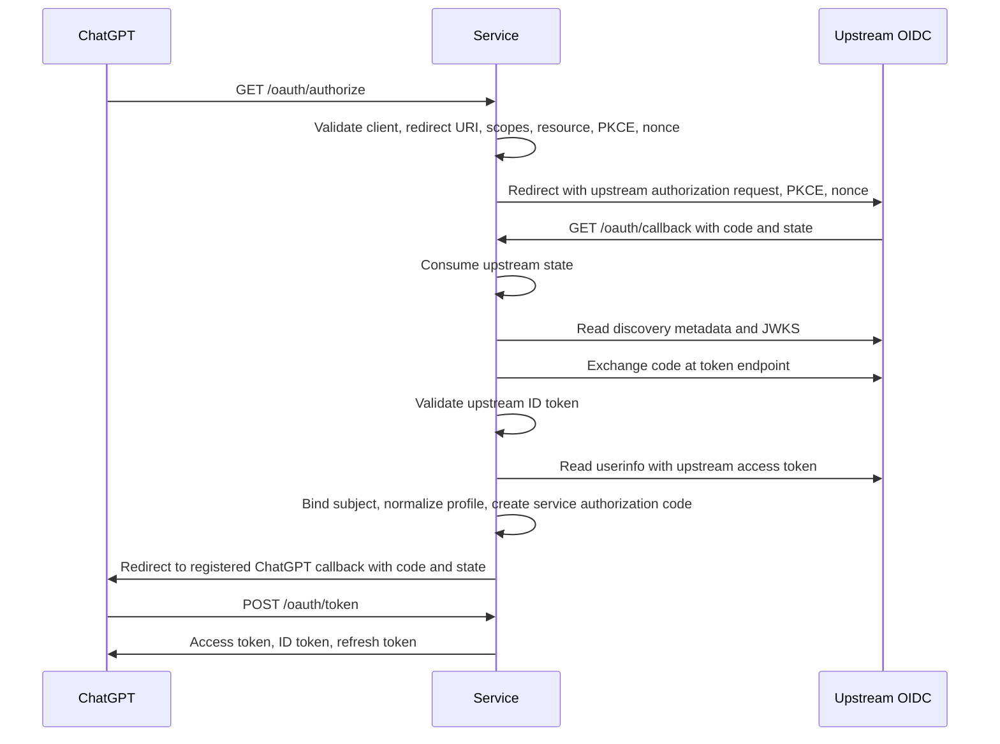

# OAuth Provider Architecture

The service acts as a private OAuth and OIDC provider for configured GPT clients. It supports authorization code flow, upstream OIDC login, refresh tokens, signed access tokens, ID tokens, userinfo, JWKS, discovery metadata, static clients, and Client ID Metadata Document clients.

## Client Types

Local development clients include:

| Client | Class | Resource access |
| --- | --- | --- |
| `local-test` | `local-test` | Actions and MCP resources. |
| `gpt-actions` | `gpt-actions` | Actions audience. |
| `gpt-apps-mcp` | `gpt-apps-mcp` | MCP resource. |

Production uses `OAUTH_CLIENTS_JSON`. URL-shaped client IDs are resolved as Client ID Metadata Documents.

Static registry clients provide exact redirect URIs, allowed scopes, allowed resources, client authentication method, PKCE policy, and client class. Metadata-document clients provide client identity material through a fetched metadata document.

| Client source | Supported token auth methods | PKCE policy | Resource model |
| --- | --- | --- | --- |
| Local generated clients | `client_secret_post` | Optional for local test and Actions, required for local Apps MCP. | Local clients can target Actions, MCP, or both according to their record. |
| Production static registry | `client_secret_post`, `client_secret_basic` | Required for public-style clients; explicit exception for confidential GPT Actions clients with a secret. | Each record lists exact allowed resource URLs. |
| Client ID Metadata Document | `none`, `private_key_jwt` | Required. | Restricted to the configured MCP resource. |

The service treats client records as security policy. Client IDs, redirect URIs, scopes, allowed resources, token endpoint auth methods, PKCE policy, and display names are validated at load or fetch time.

## Resource Binding

Access tokens use the resolved OAuth resource value as the `aud` claim.

MCP clients include `resource` during authorization, code exchange, and refresh. Local multi-resource clients also include `resource`.

GPT Actions clients may omit `resource` when the client has one allowed resource and `clientClass` is `gpt-actions`. The service binds that omitted value to the configured Actions audience.

| Surface | Expected resource |
| --- | --- |
| GPT Apps MCP | Configured MCP resource URL, usually the public issuer plus `/mcp`. |
| GPT Actions | Configured Actions audience, usually the public issuer plus `/actions`. |
| Local multi-surface test client | Explicit resource for the surface under test. |

## Scopes

Default scopes are:

- `openid`
- `profile`
- `email`

The client registry controls allowed scopes per client. Token grants reject scopes outside the current client policy.

Authorization accepts ChatGPT locale hints and keeps policy decisions tied to validated OAuth fields.

| Scope | Current use |
| --- | --- |
| `openid` | Required for token identity, ID token behavior, userinfo, session inspection, and OpenID Connect profile binding. |
| `profile` | Required for profile fields such as display name and given or family name. |
| `email` | Required for email and email verification fields. |

Future capabilities should add scopes to client records, OpenAPI declarations, MCP tool security schemes, and capability docs in one change slice.

## Token Handling

Access tokens and ID tokens are signed with RS256. ID tokens and profile endpoints return the user profile bound to the authorization grant. Refresh tokens rotate on use. Reuse of an older refresh token revokes the token family.

Authorization codes, upstream login states, and refresh tokens are stored as SHA-256 hashes. Token grant failures preserve valid authorization codes and refresh tokens when no consuming step completed.

| Token artifact | Issuer | Audience | Lifetime source | Storage |
| --- | --- | --- | --- | --- |
| Authorization code | Service | Current OAuth client and resource binding. | `AUTHORIZATION_CODE_TTL_SECONDS`. | Stored as a hash until consumed or expired. |
| Access token | Service | Resolved resource value. | `ACCESS_TOKEN_TTL_SECONDS`. | Returned to the client; storage keeps zero raw token copies. |
| ID token | Service | OAuth client ID. | `ID_TOKEN_TTL_SECONDS`. | Returned to the client; storage keeps zero raw token copies. |
| Refresh token | Service | Resolved resource value. | `REFRESH_TOKEN_TTL_SECONDS`. | Stored as a hash with token-family metadata. |

Access token claims include issuer, subject, audience, expiration, issued-at time, `nbf`, JWT ID, client ID, granted scopes, and normalized profile claims.

## Upstream OIDC Login

`/oauth/authorize` validates the GPT client request and stores an upstream login state. The service redirects the browser to the configured upstream identity provider with PKCE and a service-generated nonce. `/oauth/callback` consumes the upstream state once, reads upstream discovery metadata and JWKS, exchanges the upstream authorization code, validates the upstream ID token, validates userinfo against the ID token subject, then issues the service authorization code to the original GPT redirect URI.

The callback is owned by the service origin. Users authenticate against the configured upstream identity provider. The service uses upstream userinfo claims for the issued ID token, userinfo response, MCP profile tool, and Actions profile endpoint.

The upstream ID token must validate signature, issuer, audience, expiration, issued-at time, nonce, and access-token hash when present. Required upstream userinfo claims are `sub`, `email`, and `email_verified`. Optional display claims are normalized into the service identity profile. Signed userinfo responses must validate against the upstream JWKS, issuer, audience, and ID token subject.

The upstream provider is generic OIDC. Cognito is optional in the CDK deployment path. Any provider can be used when it supplies discovery, JWKS, authorization, token, and userinfo endpoints, supports the configured scopes, accepts the service callback URL, returns ID tokens signed with a supported algorithm, and returns the required userinfo claims.

## Client Authentication

Static clients support `client_secret_post` and `client_secret_basic`. Metadata-document clients support `none` and `private_key_jwt`.

`private_key_jwt` clients publish a same-origin JWKS. The service verifies assertion signature, issuer, subject, audience, expiration, time bounds, and `jti` replay status.

Upstream OIDC token exchange supports `client_secret_post` and `client_secret_basic`, controlled by `UPSTREAM_OIDC_TOKEN_AUTH_METHOD`.

## Discovery

The service publishes:

- `/.well-known/openid-configuration`
- `/.well-known/oauth-authorization-server`
- `/.well-known/oauth-protected-resource`
- `/.well-known/oauth-protected-resource/mcp`
- `/oauth/jwks`

Protected resource metadata advertises the MCP resource, the authorization server, supported scopes, and header bearer token use.

Discovery documents are generated from runtime configuration. Production discovery should use the public issuer URL, public MCP resource URL, public OAuth endpoints, and current signing keys.
